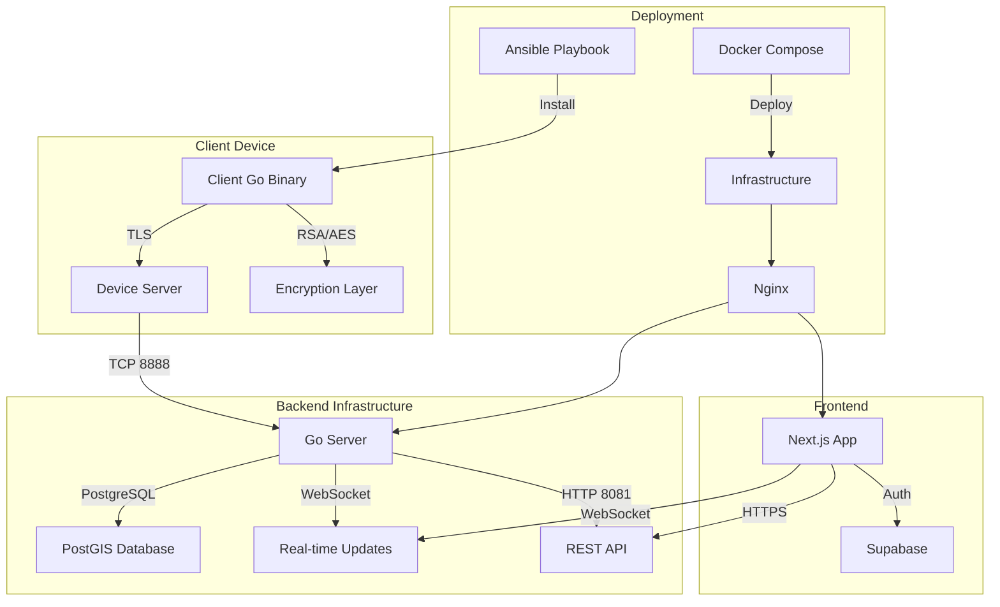

# Touch Grass Project

A distributed system for discovering and tracking WiFi hotspots, featuring device authentication, real-time updates, and interactive visualization.

## System Architecture



## Components

### Client (`/client`)
- Go-based client for Raspberry Pi devices
- Secure communication using TLS and RSA/AES encryption
- Automated Telstra WiFi hotspot detection
- MAC address rotation functionality

### Server (`/server`)
- Go backend server with HTTP and TCP endpoints
- Real-time WebSocket notifications
- JWT authentication
- PostGIS database integration
- Device data verification and processing

### Frontend (`/frontend`)
- Next.js 14 web application
- Interactive map visualization
- Real-time updates via WebSocket
- User authentication via Supabase
- Statistics and achievement tracking

### Package (`/package`)
- Ansible deployment scripts for client devices
- System service configuration
- Network management setup
- Security key generation and management

### Infrastructure (`/infra`)
- Docker Compose deployment
- PostGIS database configuration
- Nginx reverse proxy
- SSL/TLS certificate management
- Log rotation and management

## Quick Start

1. Deploy infrastructure:
```bash
cd infra
cp .env.example .env  # Configure environment variables
docker-compose up -d
```

2. Deploy client to Raspberry Pi:
```bash
cd package
ansible-playbook playbook.yml
```

3. Access dashboard:
```
https://your-domain
```

## Development Setup

### Prerequisites
- Go 1.21+
- Node.js 18+
- Docker and Docker Compose
- Ansible
- PostgreSQL with PostGIS
- PNPM

### Environment Configuration
Create appropriate .env files for each component:
- `/infra/.env` - Infrastructure configuration
- `/frontend/.env.local` - Frontend settings
- `/server/.env` - Backend configuration

## Security
- TLS encryption for all communications
- RSA key pair authentication for devices
- JWT-based API authentication
- AES-256 GCM payload encryption
- MAC address rotation for privacy

## Deployment

### Production Deployment
1. Configure DNS and obtain SSL certificates
2. Set up environment variables
3. Deploy using Docker Compose:
```bash
docker-compose -f docker-compose.yml up -d
```

### Client Deployment
Deploy to Raspberry Pi devices using Ansible:
```bash
ansible-playbook playbook.yml
```

## Project Structure
```
touch-grass/
├── client/        # Raspberry Pi client
├── server/        # Go backend server
├── frontend/      # Next.js web application
├── package/       # Ansible deployment scripts
└── infra/         # Docker and infrastructure
```

## Contributing
1. Fork the repository
2. Create a feature branch
3. Submit a pull request

## License

The Touch Grass Project is licensed under the MIT License.