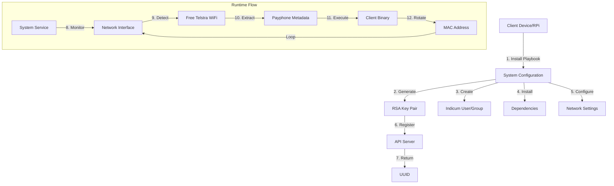

# Indicum Go Client

Secure networking client for device authentication and encrypted payload transmission to Indicum server.

## Architecture



## Features
- TLS communication with server
- RSA-2048 device authentication
- AES-256 GCM payload encryption
- Anti-forgery protection
- Frame-based protocol

## Usage

Required files:
- `/etc/indicum/uuid.txt`
- `/etc/indicum/priv_key.pem`

Run:
```bash
./client-indicum <payphone_mac> <payphone_id> <payphone_time>
```

Note: use the ansible playbook to setup the scripts and services that will automatically call the indicum-client


## Data Protocol

Frame structure:
```
FRAMESTART(0xAA55) | Length(2B) | Type(1B) | UUID | Signature | Nonce | Ciphertext
```

Payload format:
```go
type Payload struct {
    PayphoneMAC      string    // 17 chars
    PayphoneID       string    // 40 chars
    PayphoneTime     int64
    Time             int64
    ForgeResistance  string
}
```

