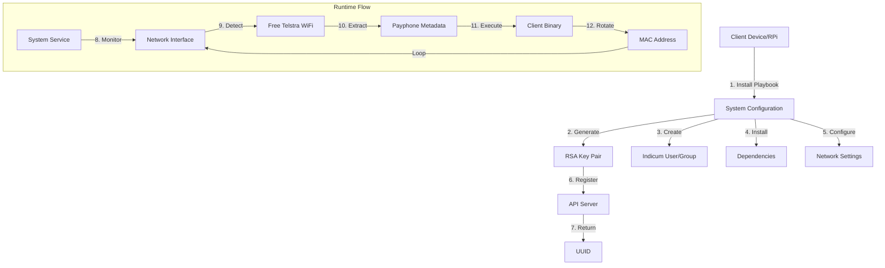

# Indicum Network Client

An automated system for Raspberry Pi deployment that handles network authentication, metadata collection, and MAC address rotation for Telstra WiFi hotspots.

## System Architecture



## Features

- Automated installation and configuration via Ansible playbook
- RSA key pair generation for secure device authentication
- Automatic network detection and connection
- Payphone metadata extraction (MAC, ID, timestamp)
- Sending data to indicum server
- Systemd service for persistent operation
- Comprehensive logging
- Network Manager integration

## Prerequisites

- Raspberry Pi with Debian-based OS
- Network interface supporting MAC address changes
- Access to the internet for initial setup
- Valid authentication token

## Installation

1. Clone this repository
2. Run the Ansible playbook:

```bash
ansible-playbook playbook.yml
```

## System Components

### 1. Ansible Playbook
- Installs required packages (git, macchanger)
- Creates Indicum user and group
- Generates RSA key pair
- Registers device with API server
- Configures system services

### 2. System Service
The `indicum.service` systemd unit ensures persistent operation with automatic restart capability.

### 3. Network Monitor Script
`run-on-device.sh` performs:
- Network interface monitoring
- Telstra WiFi hotspot detection
- Metadata extraction
- Authentication handling

### 4. Indicum client script
- The stripped binary from client/
- sends the data payload to server
- see more details at client/README.md

Note: if you update the client code, you will have to recompile the binary and then 
replace the client-indicum binary (follow instructions from client/README.md)

### 5. Network Configuration
Preconfigured NetworkManager connection profile for Telstra WiFi hotspots.

## Security Features

- Secure key generation and storage
- Isolated user and group permissions
- Protected network credentials
- Regular MAC address rotation
- Encrypted API communication

## Logging

System logs are maintained at:
- Service logs: `/var/log/run-on-device.log`
- System journal: `journalctl -u indicum`

## File Structure

```
/etc/indicum/
├── priv_key.pem
├── pub_key.pem
└── uuid.txt

/usr/local/bin/
├── client-indicum
└── run-on-device.sh

/etc/systemd/system/
└── indicum.service

/etc/NetworkManager/system-connections/
└── Free Telstra Wi-Fi.nmconnection
```

## Troubleshooting

1. Check service status:
```bash
systemctl status indicum
```

2. View logs:
```bash
tail -f /var/log/run-on-device.log
```

3. Verify network connection:
```bash
nmcli connection show
```

4. Reset service:
```bash
systemctl restart indicum
```
