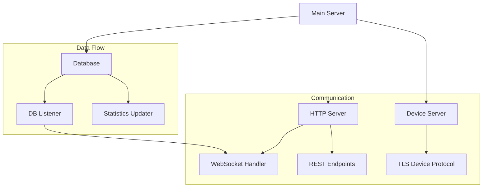

# Indicum Server

Secure server implementation for handling device authentication, data collection, and real-time user notifications.

## Architecture



## Features
- Secure device communication (TLS)
- Real-time WebSocket notifications
- JWT authentication
- PostgreSQL database integration
- Periodic statistics updates
- Device data encryption (AES-256 GCM)
- RSA key pair authentication

## Setup

### Environment Variables
```env
DB_USER=<username>
DB_PASS=<password>
DB_HOST=<host>
PGPORT=<port>
PGDATABASE=<database>
SUPABASE_JWT_SECRET=<jwt_secret>
```

### Docker Deployment
```bash
docker build -t indicum-server .
docker run -p 8081:8081 -p 8888:8888 indicum-server
```

### Manual Build
```bash
make server
./server-indicum
```

## API Endpoints

### Device Communication
- `TCP :8888` - TLS encrypted device protocol

### HTTP Server (`:8081`)
- `/map-token-pub-key` - Device registration
- `/get-entries` - Retrieve device entries
- `/statistics` - User statistics
- `/ws` - WebSocket connection
- `/nearby-hotspots` - Location-based queries

## Security
- TLS for device communication
- JWT authentication for API
- AES-256 GCM payload encryption
- RSA signing for data integrity
- Anti-forgery mechanisms

## Development

### Build Commands
```bash
make server        # Build server
make docker-server # Build for Docker
make test         # Run tests
make clean        # Clean build artifacts
```
